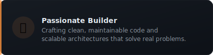
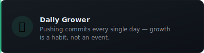
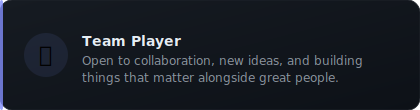
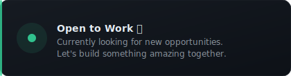
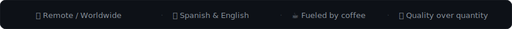

<!-- Banner SVG — upload banner.svg to the root of this repo -->

 

<!-- Typing Animation -->

 

---

                                                            - 🥸 About Me -

  

## 🛠️ Tech Stack

### 💻 Languages

### 🧩 Frameworks & Platforms

### 🗄️ Databases

### ⚙️ Tools & Workflow

---

## 📊 GitHub Stats

---

## 💡 Dev Quote of the Day

---

## 📬 Let's Connect

> *"Great software is built by great teams — let's build something amazing together."*

 

<!-- Proudly crafted with passion ☕ -->
